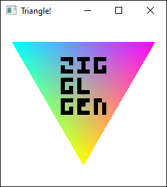

# zigglgen-example

Creates a window using [mach-glfw](https://machengine.org/pkg/mach-glfw/) and draws a triangle to it.

```sh
zig build run
```

Pass `-Dgles` to use OpenGL ES 3.0 instead of OpenGL 4.1 (Core profile).

More information about zigglgen can be found in the project's GitHub repository:
[castholm/zigglgen](https://github.com/castholm/zigglgen)


